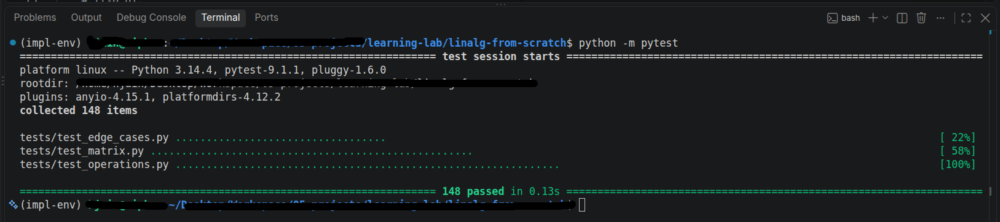

# linalg-from-scratch

A small linear algebra library written in plain Python, with no NumPy and no other dependencies.

I built it to understand how matrix operations actually work under the hood. Every operation, from matrix multiplication to solving equations, is written by hand using simple loops.

<br>

## What it can do

- Create matrices and read or change their values
- Add, subtract and scale matrices
- Multiply matrices (and a matrix by a vector)
- Transpose, trace, determinant, inverse and rank
- Solve systems of linear equations (`Ax = b`) with Gaussian elimination
- Calculate norms
- Check if a matrix is symmetric, orthogonal or the identity

<br>

## Project structure

```
linalg-from-scratch/
├── src/
│   └── linalg/
│       ├── __init__.py
│       ├── matrix.py          # The Matrix class
│       └── operations.py      # All the math functions
├── examples/
│   ├── basic_operations.py    # A tour of the main features
│   └── linear_system.py       # Solving equations step by step
├── tests/
│   ├── conftest.py            # Test setup
│   ├── test_matrix.py         # Tests for the Matrix class
│   ├── test_operations.py     # Tests for each operation
│   └── test_edge_cases.py     # Tricky and unusual inputs
├── README.md
└── .gitignore
```

The code is split in two parts on purpose:

- `matrix.py` holds the `Matrix` class. It stores the data and handles things like `+`, `-`, `*`, `==` and indexing.
- `operations.py` holds the bigger operations as separate functions, like `determinant(A)` or `inverse(A)`.

<br>

## Getting started

You only need Python 3. Clone the repo and you are ready to go.

```bash
git clone <your-repo-url>
cd linalg-from-scratch
```

To use the library from your own script, add the `src` folder to the path first. The example and test files do it like this:

```python
import sys
from pathlib import Path

sys.path.insert(0, str(Path(__file__).resolve().parents[1] / "src"))

from linalg import Matrix
from linalg.operations import determinant, inverse, matmul
```

<br>

## Quick tour

### Creating a matrix

A matrix is a list of lists. Every row must have the same length. All values are stored as floats.

```python
A = Matrix([[2, 1], [1, 3]])
print(A)
# [[2.0, 1.0],
#  [1.0, 3.0]]
```

### Reading and changing values

```python
A[0, 1]          # 1.0   (row 0, column 1)
A[0]             # [2.0, 1.0]   (the whole first row)
A[0, 1] = 9      # change one value
A[1] = [7, 8]    # replace a whole row
```

<br>

### Arithmetic

```python
B = Matrix([[0, 1], [1, 0]])

A + B            # [[2.0, 2.0], [2.0, 3.0]]
A - B            # [[2.0, 0.0], [0.0, 3.0]]
3 * A            # every value times 3
A == B           # False
```

<br>

### Operations

```python
matmul(A, B)         # [[1.0, 2.0], [3.0, 1.0]]
determinant(A)       # 5.0
inverse(A)           # [[0.6, -0.2], [-0.2, 0.4]]
```

<br>

### Solving equations

To solve these equations:

```
 2x +  y -  z =   8
-3x -  y + 2z = -11
-2x +  y + 2z =  -3
```

```python
A = Matrix([[2, 1, -1], [-3, -1, 2], [-2, 1, 2]])
b = Matrix([[8], [-11], [-3]])

x = gaussian_elimination(A, b)
print(x)
# [[2.0],
#  [3.0],
#  [-1.0]]
```

So `x = 2`, `y = 3` and `z = -1`.

<br>

## All the Operations

| Function | What it does |
|---|---|
| `shape(M)` | Returns `(rows, cols)` |
| `transpose(M)` | Flips rows and columns. Works on any shape |
| `matmul(A, B)` | Matrix multiplication |
| `matvec(A, x)` | Multiplies a matrix by a vector (a plain list). Returns a column matrix |
| `identity(M)` | Checks whether `M` is an identity matrix. Returns `True` or `False` |
| `trace(M)` | Sum of the diagonal. Square matrices only |
| `norm(M, p)` | Size of the matrix. `p` can be `2` or `"fro"`, `1`, or `"inf"` |
| `vector_to_matrix(v)` | Turns a list into a column matrix, rounded to 2 decimals |
| `is_symmetric(M)` | Checks if `M` equals its own transpose |
| `is_orthogonal(M)` | Checks if `M` times its transpose is the identity |
| `gaussian_elimination(A, b)` | Solves `Ax = b` |
| `determinant(M)` | Determinant. Square matrices only |
| `inverse(M)` | Inverse. Square and non-singular matrices only |
| `rank(M)` | Number of independent rows. Works on any shape |

<br>

## How some of it works

**Gaussian elimination** turns the [A | b] into a Row-Echelon form, then solves from the bottom row upwards. The continuous row reduction is called **forward elimination** followed by **back substitution**. 
Before each step it swaps in the row with the biggest number in the column (this is called partial pivoting). That avoids dividing by zero and keeps the numbers more accurate.

**Determinant** uses the same elimination. Once the matrix is a Upper triangle, the determinant is the product of the diagonal. Each row swap flips the sign.

**Inverse** solves `Ax = b` once for each column of the identity matrix. Those solutions become the columns of the inverse. Learnt a very interesting intuition here, and I did things myself.

**Rank** reduces the matrix to a staircase shape and counts the pivots. Very tiny numbers are treated as zero, so floating point noise doesn't give wrong answers.

<br>

## Errors you might see

The library raises clear errors instead of giving wrong answers.

| Situation | Error |
|---|---|
| Empty input, ragged rows or a flat list when creating a `Matrix` | `ValueError` |
| Adding or subtracting matrices of different sizes | `ValueError` |
| Adding a matrix to something that is not a matrix | `TypeError` |
| Multiplying a matrix by anything but a number with `*` | `TypeError` |
| `matmul` with incompatible shapes | `TypeError` |
| `trace`, `determinant`, `inverse` on a non-square matrix | `ValueError` |
| `inverse` or `gaussian_elimination` on a singular matrix | `ValueError` |
| `norm` with an unsupported `p` | `ValueError` |


<br>

## Running the examples

```bash
python examples/basic_operations.py
python examples/linear_system.py
```

Each line in the examples has its output written next to it as a comment, so you can see the results without running anything.

<br>

## Running the tests

The tests use [pytest](https://pytest.org).

```bash
pip install pytest
pytest
```

There are 148 tests across three files:

- `test_matrix.py` covers creating matrices, indexing, assignment, arithmetic, equality and printing.
- `test_operations.py` covers every function with normal inputs.
- `test_edge_cases.py` covers 1x1 matrices, zero matrices, vectors, rectangular matrices, tiny pivots, permutation matrices and checks that inputs are never modified.

Test result: 


<br>

## Things to know

This is a learning project, so a few choices are worth knowing about:

- **Rounding.** `gaussian_elimination`, `inverse` and `determinant` round their results to 2 decimal places. Results are tidy, but they are not full precision.
- **Norms.** `norm` with `p=1` adds up the absolute value of every entry. With `p="inf"` it returns the largest absolute entry. These are entry-wise norms, not the induced matrix norms.
- **Exact comparisons.** `identity` and `is_orthogonal` compare with exact equality. A rotation by an odd angle may report `False` because of tiny floating point errors.
- **Solving equations.** `gaussian_elimination` expects a square `A` and a single column `b`.
- **Speed.** Everything is plain Python loops, so it is meant for learning and small matrices. For real work, use NumPy.

<br>

## What I learned

- How matrix multiplication, determinants and inverses work step by step
- Why pivoting matters for numerical stability
- How to use pre-built Operations wisely
- How to write tests that cover normal cases, error cases and edge cases
- How to debug ( Honestly it was a lot :) )
